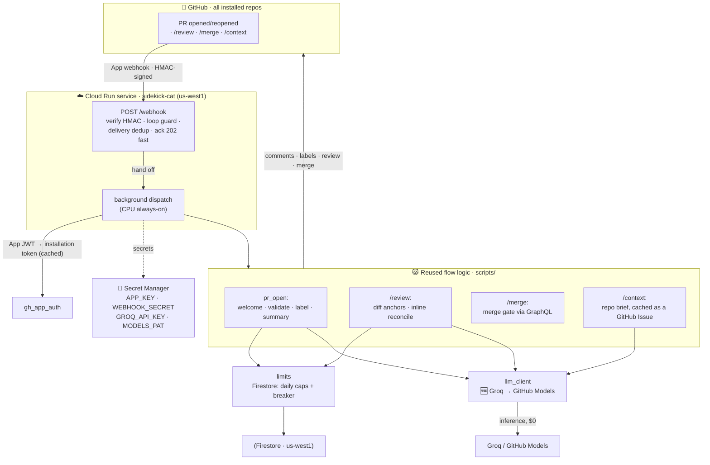

# sidekick-cat 🐱

**A code-review bot with its own name, its own face, and a $0 hosting bill.**

Most review bots either cost money per seat or post as the anonymous
`github-actions[bot]`. sidekick-cat is neither: it's a real, branded GitHub App
that reviews every PR, answers to slash commands, and never sends you an invoice
— because both LLM providers behind it are free-tier by design.


## Why you'd want this

- 🆓 **Actually free** — Groq and GitHub Models are both no-card free tiers, so
  inference can only ever 429, never bill. Cloud Run scales to zero between events.
- 🏷️ **A bot with a face, not `github-actions[bot]`** — its own GitHub App, its
  own avatar, its own voice in every comment.
- 🌐 **Zero per-repo setup** — install once on your whole account; every repo gets
  reviews, no workflow files or secrets to copy around.
- 🧵 **Reviews that don't spam** — inline threads reconcile on every re-run
  (edited, not duplicated), and `/merge` won't ship until they're resolved.
- 🛡️ **Can't run up a bill even if it wanted to** — daily caps, a circuit breaker,
  and a loop guard are baked into the request path, not bolted on after.
- 🧠 **Actually knows your repo** — caches a project-context brief (file tree, key
  files) as a GitHub Issue so reviews are grounded, not generic.

## See it in action

Open a PR, and sidekick-cat introduces itself:

> 👋 Hey @you — welcome, I'm Sidekick! Thank you so much for opening this pull
> request!
>
> - [ ] The description has a **TL;DR** — the gist in a line or two
> - [ ] The description covers **What** changed
> - [ ] The description covers **Why** it changed
> - [ ] The description includes a **Test** section so reviewers can verify it
>
> - 🏷️ I'll label this PR based on the files you touched
> - 🐱 Comment `/review` whenever you'd like my code review

Comment `/review`, and it leaves inline notes on the exact changed lines, plus a
summary:

> ### 🐱 Sidekick's code review
> VERDICT: comment
>
> Solid change overall — one race condition worth a look before merge, and a
> couple of nits inline. Nothing blocking.

## What it does

- **Open a PR** → Sidekick welcomes + assigns the author, checks the description has
  the required sections (TL;DR / What / Why / Test), labels by file type, and posts
  a short AI summary.
- **Comment `/review`** → a full AI code review: inline threads on the exact changed
  lines (severity + a fix), plus an idempotent summary comment. Re-running
  reconciles threads instead of duplicating them; an unchanged head is skipped free.
- **Comment `/context`** → (re)generates the project-context brief Sidekick uses to
  ground its reviews: a summary, folder structure, and file highlights, cached as a
  hidden GitHub Issue (`bot:context`) so it costs nothing to store. `/review` reuses
  it automatically, refreshing it lazily if it's missing or older than 30 days.
- **Comment `/merge`** → if the PR is open, conflict-free, approved (when required),
  all checks pass, every review thread is resolved, and the description passes the
  template check (re-checked live, so a stale ❌ can't be bypassed), Sidekick
  squash-merges and deletes the branch; otherwise it comments exactly why it can't.

Slash commands work only for OWNER / MEMBER / COLLABORATOR. All comments carry a
hidden `<!-- bot:* -->` marker and are upserted, so retries edit instead of spam.

## Architecture



**Edges that make it host-agnostic:** the flow logic in `scripts/` only depends on
four *edges* — trigger (webhook), GitHub auth (mint the installation token in
Python), diff fetch (REST), and inference (`llm_client`) — so it isn't tied to
Cloud Run specifically.

### Layout

```
server/         FastAPI adapter
  app.py          /webhook (verify+filter+ack+handoff), background dispatch, /health
  security.py     HMAC-SHA256 verify on the raw body
  router.py       (event, payload) → intent (pr_open | command | ignore)
  gh_app_auth.py  App JWT → installation token, cached per installation id
scripts/        reused flow logic (host-agnostic)
  welcome · validate_pr · label_pr · summarize_pr · review_pr · merge_pr
  diff_anchors · gh · llm_client · limits · config
  repo_context    per-repo project-context doc, cached as a GitHub Issue
infra/terraform/ optional `terraform destroy` button for the GCP half (see the wizard's Teardown tab)
tools/          setup_wizard.py — guided GCP/GitHub App/token setup + a Teardown tab (not part of the bot itself)
```

### Cost safeguards

The LLM side is **structurally free** — both providers are on no-card free tiers, so
they can only ever return `429`, never bill. The guards bound Cloud Run instead:
loop guard (drop bot-authored events), Firestore daily caps (global / per-repo /
per-PR) + a circuit breaker, `--max-instances=3`, `--min-instances=0`, and a $5/mo
billing budget with alerts.

## Local development

Uses [`uv`](https://docs.astral.sh/uv/) and Python 3.13. The pure logic self-checks
run fully offline — no network, no token, no Firestore (the limiter falls back to
in-memory when `LIMITS_BACKEND` is unset):

```bash
uv sync
uv run python -m scripts.tests.test_pr_logic     # flow logic
uv run python -m scripts.tests.test_limits       # caps + breaker
uv run python -m scripts.tests.test_server       # HMAC + routing
uv run python -m scripts.tests.test_llm_client   # provider fallback
```

Anything that talks to a real provider or GitHub (the module smoke mains, or
running `server/app.py` locally) needs credentials: copy
[`.env.example`](.env.example) to `.env`, fill in the keys you have, and run
with `uv run --env-file .env ...`.

## Guided setup

First time setting this up? `tools/setup_wizard.py` is a Streamlit page that
walks through the GCP project/APIs, the exact GitHub App permissions this bot
needs (traced from the actual API calls, not guessed), a webhook-secret
generator, and the GitHub Models / Groq tokens — ending in a ready-to-copy
`.env` and first-deploy command. A final **Teardown** tab covers pausing or
fully deleting everything the bot spun up, with the delete commands pre-filled
from your project id.

**[▶ Try the live wizard](https://sidekick-cat-guide.streamlit.app/)** to read
through the steps, permissions, and commands. When you're ready to enter *real*
secrets (webhook secret, tokens), run it **locally** instead — a hosted
Streamlit app runs server-side, so your input reaches Streamlit's servers,
whereas the local run keeps everything on your machine:

```bash
uv run --extra setup-wizard streamlit run tools/setup_wizard.py
```

## Deploy

Routine redeploys: `GCP_PROJECT=<your-gcp-project> ./infra/deploy.sh` (runs the
offline suites, then a source deploy that keeps the live env vars/secrets/scaling).
First-time deploys need the full command:

```bash
gcloud run deploy sidekick-cat --source . --region us-west1 \
  --allow-unauthenticated --min-instances=0 --max-instances=3 --timeout=300 \
  --no-cpu-throttling \
  --set-env-vars APP_ID=<app_id>,LIMITS_BACKEND=firestore \
  --set-secrets APP_KEY=APP_KEY:latest,WEBHOOK_SECRET=WEBHOOK_SECRET:latest,GROQ_API_KEY=GROQ_API_KEY:latest,MODELS_PAT=MODELS_PAT:latest
```

Then set the GitHub App webhook URL to the service URL + `/webhook`, subscribe to
**Pull request** + **Issue comment** events, and install on **All repositories**.

## Secrets & config (Cloud Run)

| Name | Where | Purpose |
|------|-------|---------|
| `APP_ID` | env var | GitHub App ID — JWT issuer for the installation token |
| `LIMITS_BACKEND` | env var | `firestore` to share caps/dedup across instances; unset → in-memory |
| `APP_KEY` | Secret Manager | App private key (PEM) → mints installation tokens |
| `WEBHOOK_SECRET` | Secret Manager | verifies `X-Hub-Signature-256` |
| `GROQ_API_KEY` | Secret Manager | primary inference (Groq) |
| `MODELS_PAT` | Secret Manager | fallback inference (GitHub Models; needs the `models` scope) |

See [`.env.example`](.env.example) for the full list, including the legacy
GitHub Actions workflow vars.

## License

[MIT](LICENSE)
